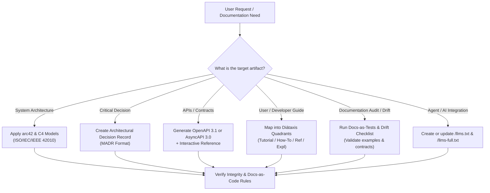

# Software Documentation Engineer (Docs-as-Code & Architecture)

This skill provides an authoritative, end-to-end framework for software documentation, rooted in international standards (**ISO/IEC/IEEE 42010:2022**, **ISO/IEC/IEEE 26500 series**), modern architectural paradigms (**arc42**, **ADRs**, **C4**), semantic authoring (**Diátaxis**), and **Docs-as-Code / Docs-as-Tests** automation.

---

## 1. Documentation Workflow for Agents

When tasked with generating or maintaining documentation, follow this decision tree:

---

## 2. Core Playbooks

### Playbook A: Diátaxis Quadrant Categorization
Do not mix cognitive goals in a single document. Choose the exact quadrant required:

1. **Tutorials (Learning-Oriented):**
   - **Target:** Absolute beginner in the specific subsystem.
   - **Form:** Step-by-step guided journey with guaranteed success.
   - **Rule:** Zero theoretical rabbit holes; focus on minimal steps to achieve a working result.
2. **How-To Guides (Task-Oriented):**
   - **Target:** Developer who already understands the basics and needs to solve a real-world task.
   - **Form:** A recipe (e.g., *"How to configure mTLS in service X"*).
   - **Rule:** Direct, practical, assumes existing proficiency.
3. **Reference (Information-Oriented):**
   - **Target:** Engineer verifying exact technical facts.
   - **Form:** Strict, neutral descriptions of machinery (parameters, return types, error matrices, schemas).
   - **Rule:** No tutorials or storytelling. Truthful reflection of the code interface.
4. **Explanation (Understanding-Oriented):**
   - **Target:** Architecture reviewers and engineers seeking the *why*.
   - **Form:** Discussion of trade-offs, discarded alternatives, domain context, design patterns.
   - **Rule:** No imperative code steps; focus on conceptual understanding.

*Detailed Guide:* [Diátaxis Framework Reference](./references/diataxis_framework.md)

---

### Playbook B: Architecture Documentation with arc42 & C4

When documenting a system or service, use the **arc42** structure mapped to **ISO/IEC/IEEE 42010:2022**:

| arc42 Section | Core Deliverable | Diagram Type (Mermaid / C4) |
| :--- | :--- | :--- |
| **1. Requirements & Goals** | Stakeholder table & Quality Goals (Resilience, TTFHW) | - |
| **2. Architecture Constraints** | Regulatory, hardware, organizational limits | - |
| **3. Context & Scope** | System boundaries, external systems, actors | `flowchart TD` / C4 Context |
| **4. Solution Strategy** | Fundamental patterns (Event-driven, Microservices, Hexagonal) | High-level overview |
| **5. Building Block View** | Static decomposition (Whitebox vs. Blackbox) | C4 Container / Component |
| **6. Runtime View** | Dynamic scenarios, concurrency, communication flows | `sequenceDiagram` |
| **7. Deployment View** | Infrastructure, clusters, networks, cloud environments | C4 Deployment / Infrastructure |
| **8. Cross-Cutting Concepts** | Security, telemetry/observability, error handling | Flowcharts & Data Schemas |
| **9. Architecture Decisions** | Pointers to ADR repository (`docs/adr/`) | - |
| **10. Quality Requirements** | Quality tree & stimulus-response scenarios | - |
| **11. Risks & Technical Debt** | Impact/probability risk matrix | - |
| **12. Glossary** | Ubiquitous Language definitions | Markdown Table |

*Template & Guide:* [arc42 and C4 Reference](./references/arc42_and_c4.md) | [arc42 Starter Example](./examples/arc42_starter.md)

---

### Playbook C: Architecture Decision Records (ADRs)

Record any irreversible or high-impact architectural choice in an immutable markdown record using **MADR** format:
- Located under: `docs/adr/NNNN-decision-title.md`
- Key fields: **Status** (Draft, Accepted, Deprecated, Superseded), **Context & Problem Statement**, **Decision Drivers**, **Considered Options**, **Decision Outcome**, **Pros & Cons**.

*ADR Template:* [MADR Template Example](./examples/madr_template.md)

---

### Playbook D: API Contracts (OpenAPI 3.1 & AsyncAPI 3.0)

When documenting interfaces, separate synchronous and asynchronous paradigms:

- **Synchronous (REST / RPC / HTTP):**
  - Use **OpenAPI 3.1** (full JSON Schema Draft 2020-12 alignment).
  - Explicitly document payloads, query params, headers, authentication, 2xx success schemas, and 4xx/5xx error structures with RFC 7807/9457 Problem Details.
- **Asynchronous / Event-Driven (Kafka, RabbitMQ, WebSockets, MQTT):**
  - Use **AsyncAPI 3.0+**.
  - Decouple **Channels** from **Operations** (`send`/`receive`). Detail message schemas (JSON Schema, Avro, Protobuf).
- **Breaking Change Prevention:**
  - Execute schema diffing before approving changes to public contracts.

*Detailed Guide:* [API Contracts & EDA Reference](./references/api_contracts_and_eda.md)

---

### Playbook E: Docs-as-Code & Docs-as-Tests

Treat documentation with identical rigor to production source code:
1. **Source Formats:** CommonMark, Markdown, or AsciiDoc stored in version control (Git).
2. **Prose Linting:** Enforce style, tone, and forbidden terminology via **Vale** rules.
3. **Docs-as-Tests:** Code blocks inside markdown must be executable and verified against real APIs/runners (e.g., Doc Detective, markdown-code-runner).
4. **Static Site Generation:** Compile to fast, searchable portals using Docusaurus, MkDocs Material, Hugo, or Starlight.

*Detailed Guide:* [Docs-as-Code & Testing Reference](./references/docs_as_code_and_tests.md)

---

### Playbook F: Documentation Drift Mitigation & KPIs

Documentation drift happens when code evolves without atomic updates to docs. Prevent it by enforcing:

1. **Pull Request Quality Gate:** Any PR altering public interfaces, environment variables, or endpoints **MUST** include corresponding updates in `docs/`.
2. **Definition of Done (DoD):** Feature is not "Done" until documentation passes linters and functional sample tests.
3. **Core Developer Experience Metrics:**
   - **TTFHW (Time to First Hello World):** Target $< 15$ minutes.
   - **Support Deflection Rate:** $\frac{\text{Self-service Sessions}}{\text{Self-service Sessions} + \text{Tickets}} \times 100\% \ge 40\% - 60\%$.
   - **Zero-result Search Rate:** $< 3\% - 5\%$ of total queries.

*Detailed Guide:* [Drift Mitigation and KPIs](./references/drift_mitigation_and_metrics.md)

---

### Playbook G: AI & Agent Optimization (`llms.txt`)

Optimize repositories so autonomous coding agents and LLMs can consume project context with zero hallucination:
- Place `/llms.txt` at the root/docs root containing concise markdown summaries and links to core documentation.
- Provide `/llms-full.txt` aggregating complete system reference when full context consumption is required.

*Specification:* [LLMs.txt and Agent Readability](./references/llms_txt_and_agent_readability.md)
