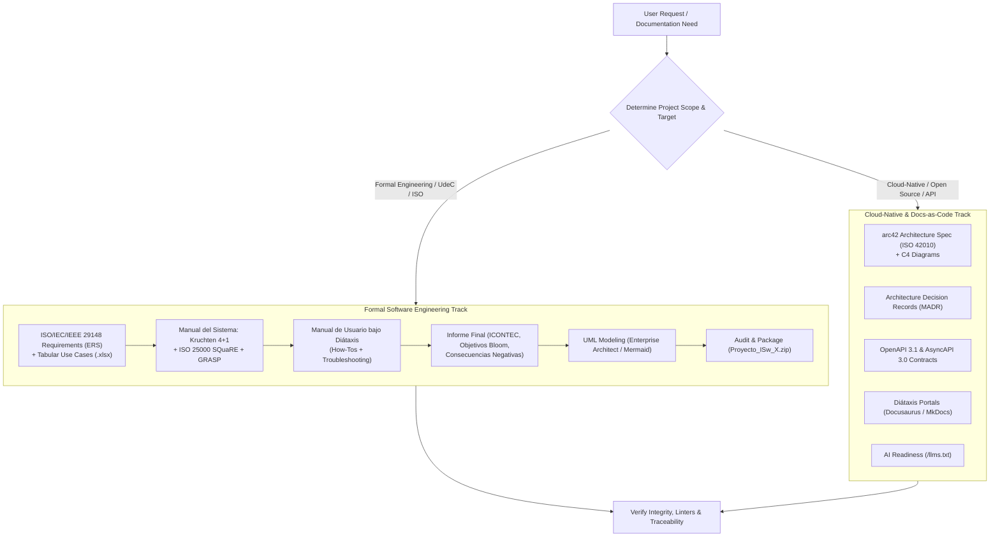

# Software Documentation Engineer (Docs-as-Code & Rigorous Software Engineering)

This skill provides an authoritative, end-to-end framework for software documentation, unifying formal international engineering standards (**ISO/IEC/IEEE 29148:2018**, **ISO/IEC/IEEE 42010:2022**, **ISO/IEC 25000 SQuaRE**, **ICONTEC**), classic architectural paradigms (**Modelo 4+1 de Kruchten**, **Craig Larman GRASP/GoF**, **Enterprise Architect**), modern Docs-as-Code practices (**arc42**, **ADRs**, **C4**, **Diátaxis**), and **AI-Agent optimization** (**llms.txt**).

---

## 1. Documentation Workflow for Agents

When tasked with generating, structuring, or auditing software documentation, follow this dual-track decision tree:

---

## 2. Core Playbooks

### Playbook A: Requirements Specification under ISO/IEC/IEEE 29148
Formulate functional and non-functional requirements without ambiguity:
1. **Functional Requirements (RF):** Strict grammar: `El sistema DEBERÁ [verbo] [resultado] cuando [condición].`
2. **Non-Functional Requirements (RNF):** Quantifiable metrics based on **ISO/IEC 25010 (SQuaRE)** (latency, concurrency, availability, security).
3. **Tabular Use Cases:** Structured specification (Actors, Preconditions, Required Data, Main Step-by-Step Flow alternating User/System actions, Alternative Flows, Exceptions).
4. **Bidirectional Traceability Matrix:** Direct mapping between RF, Use Cases, Architecture Classes, and Test Cases.

*Detailed Guide:* [ISO 29148 Requirements Guide](./references/iso_29148_requirements_spec.md) | [ERS Template](./examples/iso_29148_ers_template.md) | [Use Case Schema](./examples/caso_de_uso_spec.yaml)

---

### Playbook B: Architecture Documentation (Kruchten 4+1 & arc42 Convergence)
Unify the Kruchten 4+1 View Model with arc42 and C4 diagrams:
* **Vista de Escenarios (+1) [arc42 §1, §3 / C4 L1]:** Actors, Use Cases, Context diagram, Wireframes.
* **Vista Lógica [arc42 §5 / C4 L3]:** Layered package diagrams, class diagrams with **Larman GRASP** (Expert, Creator, Controller, Low Coupling, High Cohesion) and GoF patterns.
* **Vista de Procesos [arc42 §6 / Sequence]:** Dynamic behavior, sequence diagrams for core use cases, state diagrams, concurrency/threads.
* **Vista de Desarrollo [arc42 §5 / C4 L2]:** Component diagrams, code packages, module dependencies.
* **Vista Física [arc42 §7 / C4 Deployment]:** Deployment diagrams, hardware nodes, network topologies, communication protocols.
* **Transversal arc42 Enablers:** Quality tree (ISO 25000), Cross-cutting concepts (Security, Transactions, Observability), Risks.

*Detailed Guide:* [Kruchten 4+1 & arc42 Convergence](./references/kruchten_4plus1_convergence.md) | [ISO 25000 & GRASP](./references/iso25000_quality_attributes.md) | [Manual del Sistema Template](./examples/manual_sistema_4plus1_template.md)

---

### Playbook C: Formal Reporting & Academic Guidelines (UdeC & ICONTEC)
Produce rigorous project reports adhering to institutional rules:
1. **Format:** Strict third-person impersonal voice (*"se analizó", "se implementó"*), decimal numbering (1, 1.1, 1.1.1), centered figures and tables with source attribution.
2. **Problem Statement:** Explicit background, measurable problem description, and negative consequences.
3. **Objectives:** General and specific objectives formulated with Bloom's taxonomy verbs.
4. **Delivery Packaging:** Mandatory 4-folder ZIP structure (`Documentación/`, `Código Fuente/`, `Instaladores/`, `Anexos/`), Enterprise Architect project file (`.qea`/`.eap`), and SQL script in Anexos.
5. **Presentation Defense:** 30-minute structured presentation roadmap and technical rubric compliance.

*Detailed Guide:* [UdeC & ICONTEC Guidelines](./references/udec_and_icontec_guidelines.md) | [Informe Final Template](./examples/informe_proyecto_icontec_template.md)

---

### Playbook D: Diátaxis Quadrant Framework
Structure user manuals and developer portals avoiding cognitive overlap:
1. **Tutorials (Learning-Oriented):** Welcome onboarding, First-Run Experience (FTUX).
2. **How-To Guides (Task-Oriented):** Step-by-step recipes for specific user goals (by role).
3. **Reference (Information-Oriented):** Unbiased facts, schemas, parameter descriptions, error code matrices.
4. **Explanation (Understanding-Oriented):** Conceptual background, architectural rationale, trade-off analysis.

*Detailed Guide:* [Diátaxis Framework Reference](./references/diataxis_framework.md) | [Manual de Usuario Template](./examples/manual_usuario_diataxis_template.md)

---

### Playbook E: Architecture Decision Records (ADRs via MADR)
Record irreversible architectural choices in Git-versioned markdown files under `docs/adr/NNNN-decision-title.md`:
* Includes: Status, Context, Decision Drivers, Considered Options, Outcome, Pros & Cons.

*Detailed Guide:* [MADR Template Example](./examples/madr_template.md)

---

### Playbook F: API Contracts (OpenAPI 3.1 & AsyncAPI 3.0)
* **REST / RPC:** OpenAPI 3.1 aligned with JSON Schema 2020-12 and RFC 7807/9457 Problem Details.
* **Event-Driven / WebSockets:** AsyncAPI 3.0 decoupling channels and message schemas.

*Detailed Guide:* [API Contracts & EDA Reference](./references/api_contracts_and_eda.md)

---

### Playbook G: Docs-as-Code, Quality Linters & AI Optimization
1. **Linters:** CommonMark linting (`markdownlint`), prose quality (`Vale`), link verification (`lychee`).
2. **Docs-as-Tests:** Executable code block verification.
3. **AI Indexing:** Generate and maintain `/llms.txt` and `/llms-full.txt` for hallucination-free consumption by autonomous coding agents.

*Detailed Guide:* [Docs-as-Code & Tests](./references/docs_as_code_and_tests.md) | [Drift Mitigation](./references/drift_mitigation_and_metrics.md) | [llms.txt Guide](./references/llms_txt_and_agent_readability.md)

---

## 3. Automation Scripts & Office Integration

The skill includes automated Python scripts for artifact generation and validation:
* **Export Use Cases to Excel:** `python scripts/export_casos_uso_xlsx.py --input casos.json --output "Casos_de_Uso.xlsx"`
* **Audit Delivery & Package ZIP:** `python scripts/audit_and_package_project.py --dir . --grupo 1`
* **Base Templates Available:** Located in `templates/` (`plantilla_informe_proyecto.docx`, `plantilla_manual_sistema.docx`, `plantilla_casos_uso.xlsx`).
