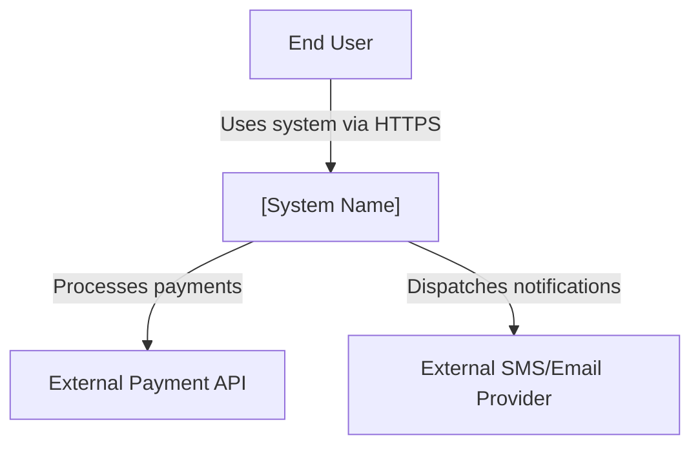
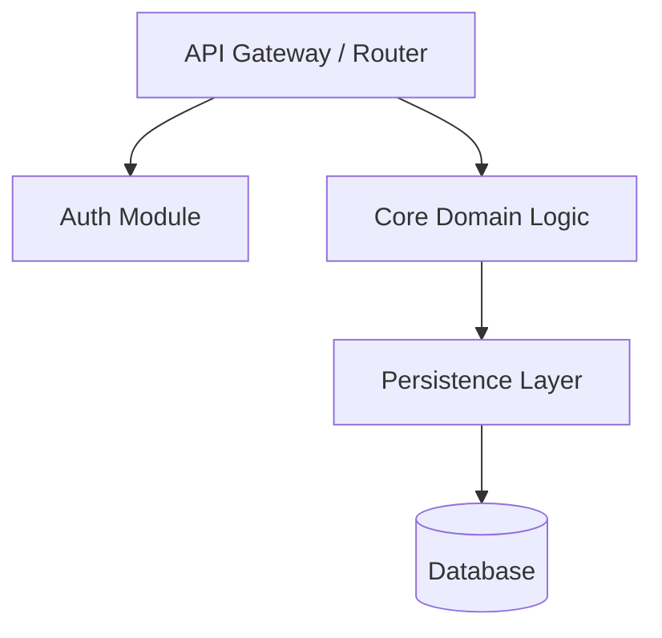
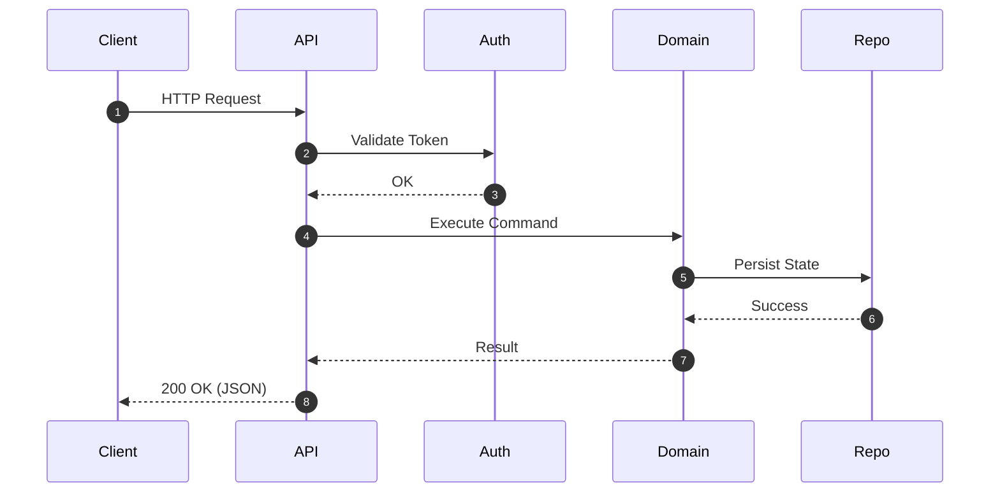
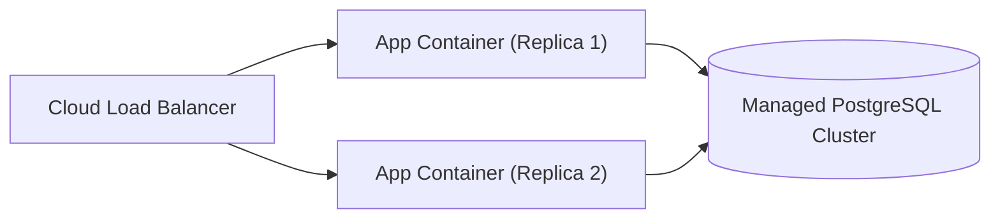

# Architecture Documentation: [System Name]

*Version:* 1.0.0  
*Date:* [YYYY-MM-DD]  
*Standard:* arc42 / ISO/IEC/IEEE 42010:2022  

---

## 1. Introduction and Goals

### 1.1 Requirements Overview
[Briefly describe the key functional requirements and business goals.]

### 1.2 Quality Goals
1. **Resilience & Availability:** System maintains 99.9% uptime.
2. **Developer Velocity & TTFHW:** New developers can run the system locally in $< 15$ minutes.

### 1.3 Stakeholders
| Role/Name | Contact | Expectations |
| :--- | :--- | :--- |
| Product Owner | @po | Delivery of business requirements on schedule |
| Operations/SRE | @sre | Automated observability, low MTTR |
| Dev Team | @devs | Clean code, maintainable architecture, low cognitive load |

---

## 2. Architecture Constraints

* **Language/Platform:** [e.g., Node.js / Go / Python]
* **Hosting:** [e.g., AWS EKS / GCP Cloud Run]
* **Compliance:** [e.g., GDPR, SOC2]

---

## 3. Context and Scope

### 3.1 Business Context

---

## 4. Solution Strategy

* **Architecture Style:** [e.g., Modular Monolith / Microservices / Event-Driven]
* **Persistence:** [e.g., PostgreSQL for transactional consistency, Redis for caching]
* **Security:** [e.g., OAuth 2.0 + OpenID Connect with JWT Bearer validation]

---

## 5. Building Block View (Level 1)

---

## 6. Runtime View

---

## 7. Deployment View

---

## 8. Cross-Cutting Concepts

* **Logging & Observability:** Structured JSON logs via OpenTelemetry.
* **Error Handling:** Standardized responses using RFC 7807 Problem Details.
* **Authentication & Authorization:** RBAC (Role-Based Access Control).

---

## 9. Architecture Decisions

Architecture Decision Records are located in [`docs/adr/`](./docs/adr/).
* [ADR-0001: Choice of Database](./docs/adr/0001-choice-of-database.md)
* [ADR-0002: Event Broker Selection](./docs/adr/0002-event-broker.md)

---

## 10. Quality Requirements

| Quality Attribute | Scenario | Metric |
| :--- | :--- | :--- |
| Latency | Under peak load of 1000 RPS, P95 response time is $< 200\text{ ms}$. | P95 latency |
| Scalability | Automatic pod scale-out when CPU exceeds 70%. | Horizontal Pod Autoscaler |

---

## 11. Risks and Technical Debt

* Risk: Single region database failure could cause downtime until failover completes ($< 60\text{ s}$).
* Mitigation: Automated cross-region replica promotion planned for Q3.

---

## 12. Glossary

| Term | Definition |
| :--- | :--- |
| **Idempotency** | The property of an operation where multiple identical requests produce the same effect as a single request. |
| **TTFHW** | Time to First Hello World; elapsed time until a new developer runs their first working integration. |
