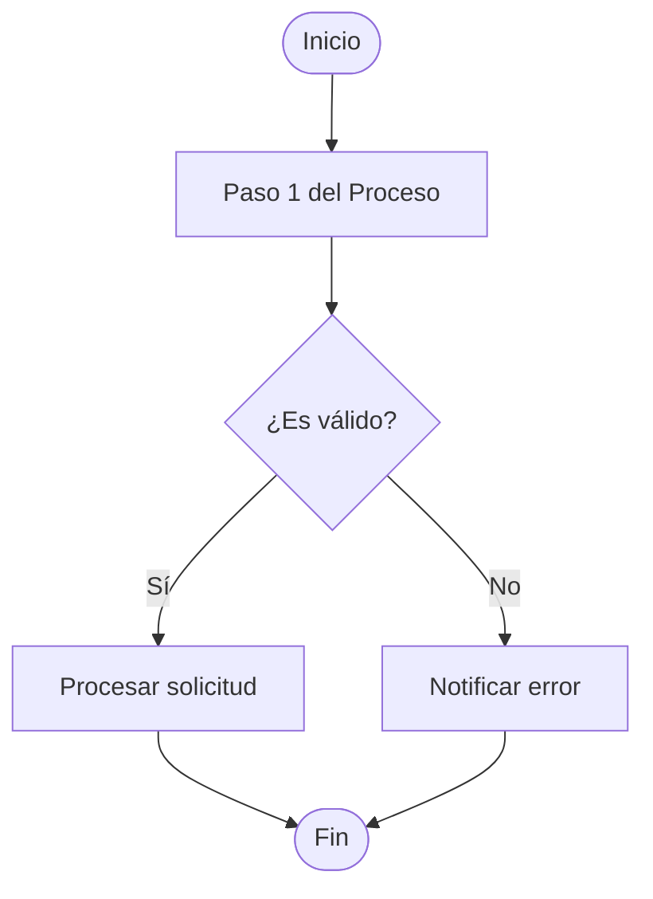
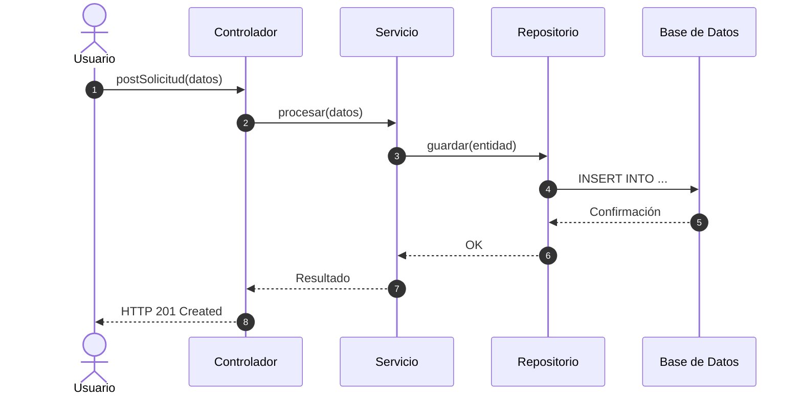

# MANUAL DEL SISTEMA PARA PROYECTO DE SOFTWARE
## Arquitectura en Vistas 4+1 (Kruchten) y Modelo de Negocio

**Proyecto:** [Nombre del Sistema]  
**Equipo de Desarrollo:** Grupo [X] - [Integrantes]  
**Institución:** Universidad de Cartagena - Programa de Ingeniería de Sistemas  
**Fecha:** [Mes Año]  

---

## Introducción
[Breve descripción del alcance del manual técnico, objetivos arquitectónicos y tecnologías utilizadas en la solución.]

---

## 1. Modelo de Negocio

### 1.1 Procesos de Negocio
[Explicación contextual de la operación empresarial y su descomposición. Cada proceso debe acompañarse de su diagrama de actividades.]

#### Proceso Específico 1: [Nombre del Proceso 1]
* **Objetivo:** [Qué persigue el proceso]
* **Entradas y Salidas:** [Insumos y resultados]
* **Diagrama de Actividades (UML):**

### 1.2 Casos de Uso del Mundo Real
[Casos de uso del negocio antes de sistematizar la solución. Interacción entre actores externos y el negocio.]

### 1.3 Modelo de Dominio
[Diagrama conceptual de clases del negocio sin detalles de implementación de software, mostrando entidades, atributos esenciales y relaciones semánticas.]

### 1.4 Glosario
| Término | Definición en el Contexto del Negocio |
| :--- | :--- |
| [Término 1] | [Definición precisa] |

---

## 2. Requisitos del Sistema
[Resumen de los requisitos funcionales priorizados, catálogo consolidado de casos de uso del software y atributos de calidad conforme a la norma ISO/IEC 25000. Referenciar el anexo formal con la ERS ISO 29148.]

---

## 3. Modelo de Diseño (Vistas 4+1)

### 3.1 Vista de Escenarios (+1)
#### 3.1.1 Casos de Uso del Sistema
[Diagrama general de casos de uso (UML) y enlace a las especificaciones tabulares detalladas.]

#### 3.1.2 Diseño de Interfaz Gráfica de Usuario (GUI)
[Argumentación ergonómica y heurística de diseño. Wireframes o capturas de pantalla de los flujos principales.]

### 3.2 Vista Lógica
#### 3.2.1 Arquitectura del Sistema
[Estilo arquitectónico elegido: Capas, Clean Architecture, Hexagonal o Microservicios. Diagrama de paquetes lógicos.]
#### 3.2.2 Diseño del Sistema
[Diagrama de clases detallado de la solución, justificando la asignación de responsabilidades mediante patrones GRASP (Experto, Controlador, Creador) y patrones de diseño GoF.]

### 3.3 Vista de Procesos
[Aspectos dinámicos y de concurrencia. Diagramas de secuencia UML para los casos de uso más representativos, detallando mensajes síncronos/asíncronos y respuestas.]

---

## 4. Modelo de Implementación

### 4.1 Vista de Desarrollo
[Organización del código fuente en subsistemas y componentes físicos. Diagrama de componentes UML y librerías utilizadas.]

### 4.2 Vista Física (Despliegue)
[Infraestructura de hardware y red. Diagrama de despliegue UML con servidores web, servidores de aplicaciones, base de datos y protocolos de interconexión (HTTPS, TCP/IP, SSH).]

---

## 5. Anexos
[Punteros a la ERS ISO 29148, script SQL, matriz de pruebas y actas de levantamiento de información.]
