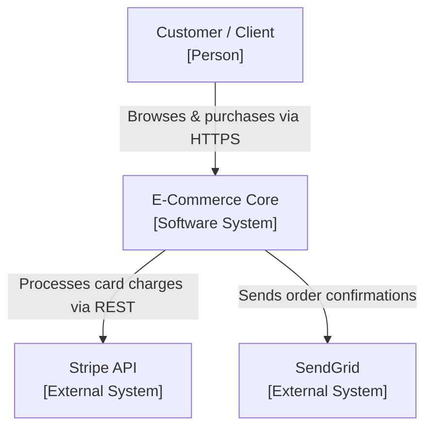
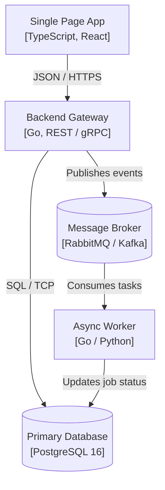
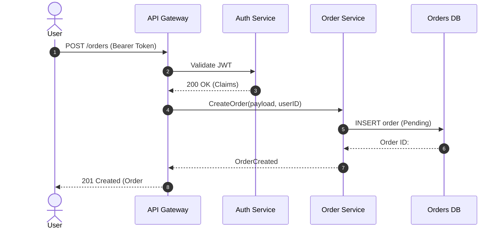

# arc42 Architecture Template & C4 Model Guide

The combination of the **arc42** template (by Peter Hruschka and Gernot Starke) and Simon Brown's **C4 Model** represents the industry standard for communicating software architecture, aligned with **ISO/IEC/IEEE 42010:2022**.

---

## 1. Mapping arc42 to ISO/IEC/IEEE 42010:2022

| arc42 Section | Purpose | ISO/IEC/IEEE 42010 Dimension |
| :--- | :--- | :--- |
| **1. Introduction & Goals** | High-level requirements, business goals, quality goals. | Stakeholders & Concerns |
| **2. Architecture Constraints** | Organizational, legal, technological constraints. | Operational environment & governance |
| **3. Context & Scope** | Delimits the boundary between system and external world. | System of Interest (SoI) boundaries |
| **4. Solution Strategy** | Fundamental architectural decisions and patterns. | Architecture Rationale |
| **5. Building Block View** | Static decomposition into nested whiteboxes. | Structural Viewpoint |
| **6. Runtime View** | Dynamic interaction of blocks for key scenarios. | Behavioral Viewpoint |
| **7. Deployment View** | Physical / virtual infrastructure and networks. | Deployment / Operational Viewpoint |
| **8. Cross-Cutting Concepts** | Security, persistence, observability, error handling. | Cross-cutting Concerns |
| **9. Architecture Decisions** | Pointers to formal ADRs (`docs/adr/`). | Decision traceability |
| **10. Quality Requirements** | Formal quality tree and stimulus-response scenarios. | Quality verification metrics |
| **11. Risks & Technical Debt** | Known weaknesses and risk assessment. | Residual risk & architectural debt |
| **12. Glossary** | Domain language and Ubiquitous Language. | Shared domain ontology |

---

## 2. Incorporating C4 Diagrams in Mermaid.js

Instead of static image binaries, render C4 diagrams directly using Mermaid code blocks.

### Level 1: System Context Diagram
Shows the system in its environment, with users and external dependencies.

### Level 2: Container Diagram
Decomposes the system into high-level containers (apps, datastores, APIs).

### Level 3: Runtime Scenario (Sequence Diagram)
Shows runtime interactions between components for a specific critical transaction.

